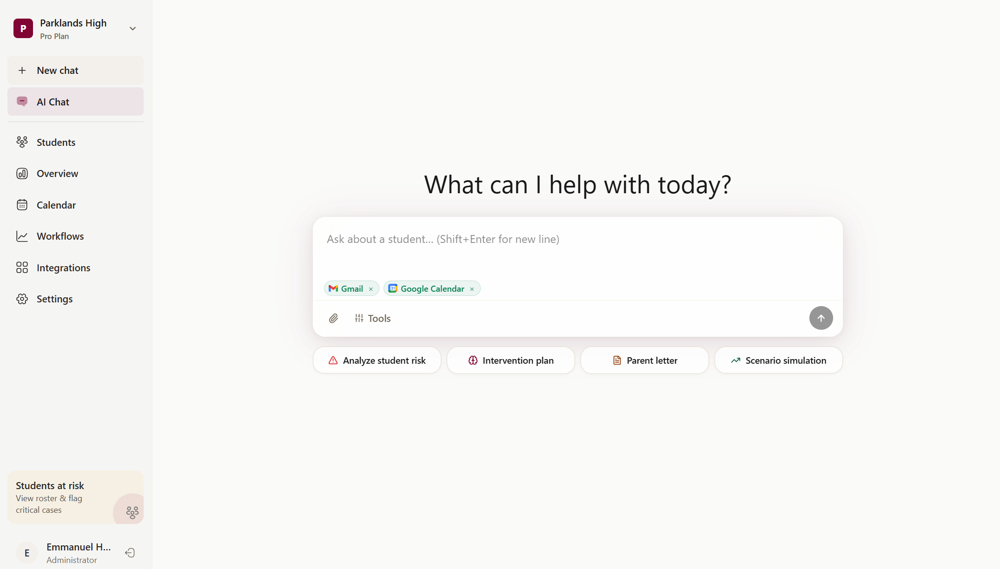

<p align="center">
  
</p>

<h1 align="center">RIN — Responsible Insight Navigator</h1>

<p align="center">
  <strong>AI-powered student dropout risk intelligence for K–12 schools</strong><br/>
  Built for <a href="#">DevDash 2026: The Sprint to Solution</a> · EdTech & AI Track
</p>

<p align="center">
  
  
  
  
  
  
  
</p>

---

## 📸 Platform Preview

<p align="center">
  
</p>

---

## 📋 Problem Statement

Student dropout is one of the most pressing challenges in K–12 education. Nationwide, over **1.2 million students** drop out every year. Educators and counselors often lack the tooling to identify at-risk students early enough to intervene effectively. Traditional methods rely on delayed indicators, gut feeling, or siloed spreadsheets — by the time a student is flagged, it's often too late.

## 💡 Our Solution

**RIN** is an AI-powered platform that gives K–12 educators real-time dropout risk intelligence through a conversational interface. Instead of wading through dashboards or spreadsheets, educators simply describe a student's situation and RIN provides:

- **Risk Scores** (0–100) with confidence levels and severity categories
- **Contributing Factors** ranked by impact with trend indicators
- **Intervention Plans** with prioritized, actionable steps for counselors
- **What-If Scenarios** showing how specific changes could reduce risk
- **Parent Communication** — auto-generated letters and talking points
- **Slide Deck Generation** — presentation-ready reports for staff meetings
- **Automated Workflows** — trigger SMS alerts, emails, and calendar events when risk thresholds are crossed

All powered by a dynamic AI agent that connects to the tools schools already use — Gmail, Slack, Google Calendar, Google Classroom, Sheets, Drive, and more.

---

## 🏗️ Architecture

```
┌──────────────────────────────────────────────────────────────────┐
│                 RIN Dashboard (Next.js 15 App Router)            │
├────────────┬──────────────┬──────────────┬───────────────────────┤
│  Landing   │  AI Chat     │  Students    │  Workflows Builder    │
│  Page      │  Interface   │  Roster &    │  (React Flow)         │
│            │  (Streaming)  │  Risk Board  │                       │
├────────────┼──────────────┼──────────────┼───────────────────────┤
│  Overview  │  Calendar    │  Integrations│  Settings &           │
│  Analytics │  Sync        │  Hub         │  School Admin         │
├────────────┴──────────────┴──────────────┴───────────────────────┤
│               Next.js API Routes (Server-side)                   │
│   /api/chat (streaming) · /api/analyze · /api/intervention       │
│   /api/ai/generate-workflow · /api/integrations                  │
├──────────────────────────────────────────────────────────────────┤
│   Dynamic System Prompt + Composio Tool Routing                  │
│   Zod Schema Validation + Structured Output Parsing              │
├──────────────────────────────────────────────────────────────────┤
│             OpenAI GPT-4o (via Thesys C1 Gateway)                │
├──────────────────────────────────────────────────────────────────┤
│   Composio SDK (11 integrations) · Resend · Twilio               │
├──────────────────────────────────────────────────────────────────┤
│   PostgreSQL (Supabase) · BetterAuth · Drizzle ORM              │
└──────────────────────────────────────────────────────────────────┘
```

---

## 🛠️ Tech Stack

| Layer               | Technology                                                        |
| ------------------- | ----------------------------------------------------------------- |
| **Framework**        | Next.js 15 (App Router, Server Components)                        |
| **UI**               | React 19 + TypeScript 5                                           |
| **Styling**          | Vanilla CSS (inline styles, custom design system)                 |
| **AI Model**         | OpenAI GPT-4o (via Thesys C1 Gateway)                             |
| **AI Agent**         | Dynamic system prompt with per-integration tool routing            |
| **Integrations**     | Composio SDK — 11 integrations across 5 categories                |
| **Workflow Engine**  | React Flow + custom step registry + Composio action executors     |
| **Auth**             | BetterAuth (email/password, session-based)                        |
| **Database**         | PostgreSQL on Supabase + Drizzle ORM                              |
| **Email**            | Resend (transactional emails, parent alerts)                      |
| **SMS**              | Twilio (SMS parent notifications)                                 |
| **Icons**            | Iconify (via `@iconify/react`) + Lucide React                    |
| **Deployment**       | Vercel                                                            |

---

## 🔌 Integrations (11+ tools)

RIN connects to the tools schools already use via **Composio managed auth**:

| Category                  | Tools                                          |
| ------------------------- | ---------------------------------------------- |
| **Communication & Calendar** | Gmail, Slack, Microsoft Teams, Outlook, Google Calendar |
| **LMS & Classroom**       | Google Classroom, Canvas LMS                   |
| **Data & Reports**        | Google Sheets, Microsoft Excel                 |
| **Documents & Storage**   | Notion, Google Drive                           |

The AI agent dynamically detects connected integrations and adjusts its behavior — preferring Gmail over fallback email, using Calendar for scheduling, Sheets for data export, etc.

---

## 📖 Features

### 🤖 Conversational AI Chat
Describe a student's situation in plain language. RIN responds with structured risk assessments, contributing factors, intervention recommendations, and follow-up questions — all in educator-friendly language.

### 📊 Student Roster & Risk Board
Manage all students in one place. View risk scores, categories (Low / Moderate / At Risk / Critical), and trend indicators at a glance.

### 📈 Analytics Overview
Aggregated insights across all analyses: risk distribution charts, contributing factors breakdown, radar charts, and analysis history.

### ⚡ Visual Workflow Builder
Drag-and-drop workflow automation powered by React Flow. Build trigger → action → condition chains with integration nodes for Slack, Gmail, Calendar, Sheets, Notion, and Drive. AI can also generate workflows from natural language.

### 🔗 Integrations Hub
One-click OAuth connections to 11 tools via Composio. Each integration card shows connection status with connect/disconnect actions.

### 📅 Calendar Sync
Bi-directional Google Calendar integration for scheduling intervention meetings and follow-ups.

### 📝 Document Generation
Auto-generate parent letters, intervention plans, and presentation slide decks from any risk analysis.

### 🔔 Automated Alerts
Workflow-triggered SMS (Twilio) and email (Resend) notifications to parents and staff when risk thresholds are crossed.

### 🏫 Multi-Tenant School System
Create or join schools with invite codes. Role-based access (Educator, Counselor, Administrator). School-scoped data isolation.

---

## 🤖 AI Disclosure

This project uses AI in the following ways:

- **Core Analysis Engine**: OpenAI GPT-4o (via Thesys C1) powers all student risk assessments, intervention recommendations, scenario simulations, parent letter drafting, and follow-up analysis.
- **Dynamic System Prompt**: The AI agent's behavior adapts at runtime based on which Composio integrations are connected, injecting per-tool instructions and fallback chains.
- **Workflow Generation**: A dedicated AI endpoint converts natural language descriptions into React Flow workflow graphs with appropriate integration action nodes.
- **Development Assistance**: AI coding assistants (Gemini via Antigravity) were used during development to accelerate implementation.

---

## 🚀 Getting Started

### Prerequisites

- [Node.js](https://nodejs.org/) 18+ installed
- A PostgreSQL database (we recommend [Supabase](https://supabase.com/))
- API keys for OpenAI/Thesys, Composio, Resend, and Twilio (see below)

### Setup

```bash
# 1. Clone the repository
git clone https://github.com/DavidKasompe/rin-dashboard-nextjs.git
cd rin-dashboard-nextjs

# 2. Install dependencies
npm install

# 3. Configure environment variables
cp .env.example .env.local
# Edit .env.local and fill in your keys (see table below)

# 4. Push the database schema
npx drizzle-kit push

# 5. Start the development server
npm run dev
```

Open [http://localhost:3000](http://localhost:3000) in your browser.

### Environment Variables

| Variable                        | Description                                        | Required |
| ------------------------------- | -------------------------------------------------- | -------- |
| `OPENAI_API_KEY`                | OpenAI API key                                     | ✅       |
| `THESYS_API_KEY`                | Thesys C1 gateway key (wraps OpenAI)               | ✅       |
| `DATABASE_URL`                  | PostgreSQL connection string                       | ✅       |
| `BETTER_AUTH_SECRET`            | 32-char random secret for session auth             | ✅       |
| `BETTER_AUTH_URL`               | App base URL (`http://localhost:3000`)              | ✅       |
| `NEXT_PUBLIC_BETTER_AUTH_URL`   | Public app URL                                     | ✅       |
| `NEXT_PUBLIC_SUPABASE_URL`      | Supabase project URL                               | ✅       |
| `SUPABASE_SERVICE_ROLE_KEY`     | Supabase service role key                          | ✅       |
| `COMPOSIO_API_KEY`              | Composio API key for integrations                  | ✅       |
| `RESEND_API_KEY`                | Resend API key for email notifications             | Optional |
| `TWILIO_ACCOUNT_SID`           | Twilio account SID for SMS                         | Optional |
| `TWILIO_AUTH_TOKEN`            | Twilio auth token                                  | Optional |
| `TWILIO_PHONE_NUMBER`         | Twilio sender phone number                         | Optional |
| `AUTUMN_SECRET_KEY`            | Autumn billing key (test/prod)                     | Optional |

---

## 👥 Team

| Name                   | Role                          | GitHub                                                     |
| ---------------------- | ----------------------------- | ---------------------------------------------------------- |
| **Emmanuel Haankwenda** | Full-Stack Developer & AI Lead | [@emmanuelhaankwenda](https://github.com/emmanuelhaankwenda) |
| **David Kasompe**       | Full-Stack Developer & Design  | [@DavidKasompe](https://github.com/DavidKasompe)           |

---

## 🔮 Future Roadmap

- [ ] **"RIN Learn" Add-On** — Student-facing AI tutoring environment with AI chat, audio-to-notes, visual concept breakdowns, flashcard/quiz generation, and teacher visibility into learning gaps
- [ ] Fine-tuned model for higher accuracy dropout prediction
- [ ] Batch analysis via CSV upload
- [ ] PDF report generation with charts
- [ ] Early warning alert dashboard with triggered notifications
- [ ] Multi-language support for international schools
- [ ] Mobile app (React Native) for field educators
- [ ] District-wide analytics with cohort heatmaps
- [ ] SSO and FERPA-compliant data handling

---

## 📄 License

MIT License — see [LICENSE](LICENSE) for details.
