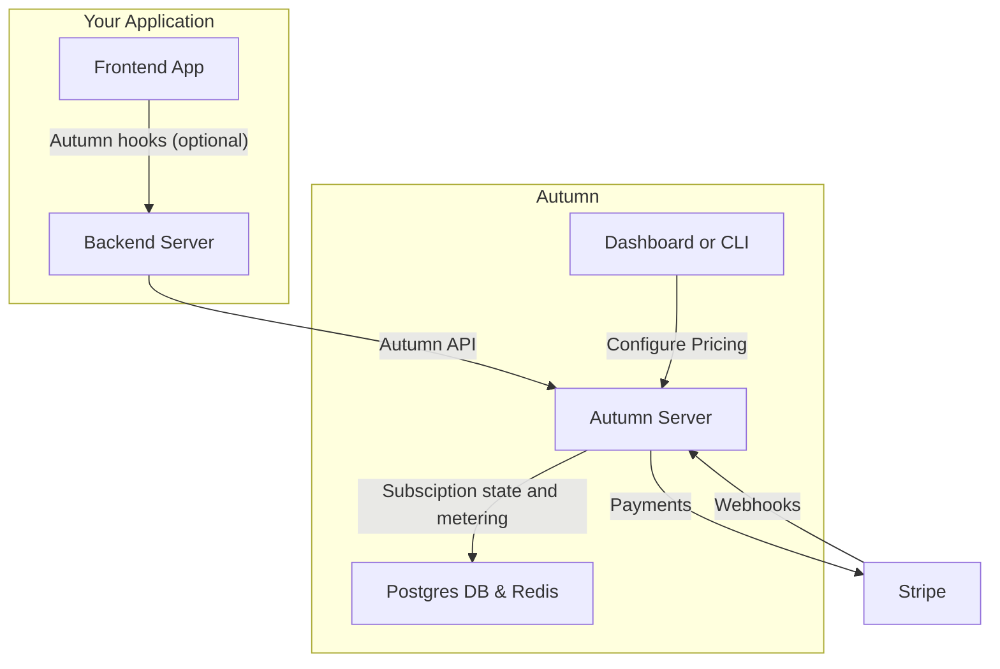
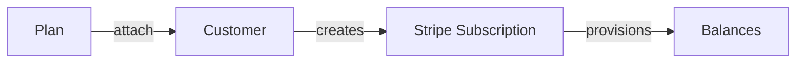
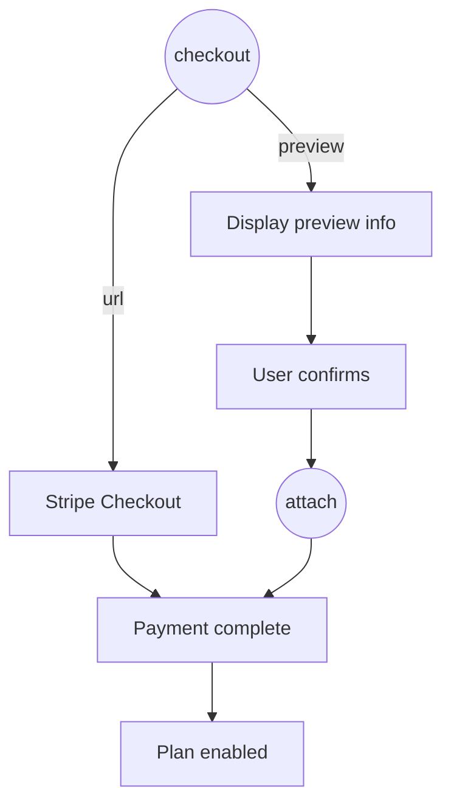
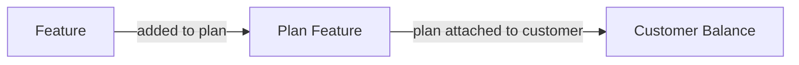

> ## Documentation Index
> Fetch the complete documentation index at: https://docs.useautumn.com/llms.txt
> Use this file to discover all available pages before exploring further.

# Welcome to Autumn

> Open-source billing infrastructure that manages webhooks, usage limits and credits.

## What is Autumn?

Autumn handles your billing flows and makes sure your customers have the access to the right features and limits.

It sits between your server and Stripe billing, and acts as your managed database for subscription status, usage metering and credit balances.

1000s of founders and fast-growing startups use Autumn to make billing easier and more reliable. No webhooks needed!

## How it works



<Steps>
  <Step title="Model your pricing in Autumn">
    Model your pricing plans in the Autumn UI, or through a config file. Define your free, paid and any add-on pricing tiers.

    A typical billing provider (eg, Stripe) would let you configure your pricing -- then send you webhooks to handle the rest. In Autumn, you define *both pricing and the features that customers get access to*.

    You can link features to these plans and define their usage limits: both recurring (monthly, yearly) and one-time grants.
  </Step>

  <Step title="Handle payments">
    The `checkout` function will return a Stripe checkout URL, or confirmation data for an upgrade/downgrade for the plans you defined in step 1.

    Once paid, the Autumn will grant access to the features on their plan.
  </Step>

  <Step title="Check permissions and limits">
    When a customer tries to do something (eg, use a credit), [check](/documentation/customers/check) in real-time whether they're allowed to.

    If the user has access to the feature on their plan, and hasn't exceeded their usage limit, they will be allowed to do it.
  </Step>

  <Step title="Track usage">
    If Autumn tells you they're `allowed` access, let them use the feature. Afterwards, you can [track the usage](/documentation/customers/tracking-usage) to update their balance, or bill them for any usage-pricing.
  </Step>
</Steps>

Autumn also provides APIs to easily get customer billing data (to display on a billing page), open Stripe billing portal, display usage analytics, handle org billing, setup referral programs and more.

## Why use Autumn?

Reliable billing is hard to setup and maintain. When integrating Stripe directly, you are responsible for:

* **Syncing subscription state**: active, overdue payments, cancelling, 5-10 webhooks
* **Plan switching**: upgrades, scheduled downgrades, add ons
* **Usage limits**: monthly recurring limits, one-time limits, spend limits, credits
* **Custom plans**: and plan versioning, pricing migrations

The problem gets worse as your codebase and pricing changes. Billing code becomes a sprawling mess of edge cases, race conditions and takes time away from building your product.

Autumn is a managed service that replaces this logic. Your server makes queries to Autumn, and it tells you if a customer can "do something" (eg, send a chatbot message, access premium features, etc), based on your pricing plan configuration.

This gives you flexibility to make pricing changes, or define custom plans for important customers without touching any code.

## What Autumn is not

* **A Stripe billing replacement**: although you don't need to deal with Stripe's APIs, you are still using (and paying for) Stripe's subscriptions, payments and invoicing. You bring your own Stripe account and are never "locked in" to our system.

<Card title="Join us on Discord" icon="discord" href="https://discord.gg/STqxY92zuS">
  Connect with us, other users, and get integration support within minutes --
  we're always online (if we're awake)
</Card>


> ## Documentation Index
> Fetch the complete documentation index at: https://docs.useautumn.com/llms.txt
> Use this file to discover all available pages before exploring further.

# Migrating to Autumn

> How to migrate your existing Stripe customers to Autumn

It's easy to move your existing customers to Autumn. The Autumn team will help you move your subscriptions and purchases over without any disruption. The main reasons teams migrate are:

* **Speed** - Team-based billing, multi-interval usage limits, auto-topups, timeseries charts: all handled by Autumn out of the box.
* **Flexibility** — Plan versioning, custom deals, and pricing changes without code deploys
* **Reliability** — No webhook edge cases, race conditions, or state sync issues to debug

## Migration Steps

<Steps>
  <Step>
    ### Replace your existing billing code with Autumn

    Start by integrating Autumn in your development environment. Replace your existing Stripe billing logic with Autumn's SDK:

    * Set up your pricing plans in the [Autumn dashboard](https://app.useautumn.com)
    * Install the Autumn SDK and configure your API keys
    * Replace Stripe checkout, subscription management, and usage tracking with Autumn equivalents

    See our [setup guides](/documentation/getting-started/setup/react) for detailed integration instructions.
  </Step>

  <Step>
    ### Link your production Stripe account

    Connect your existing Stripe account to Autumn in your production environment. This gives us access to your active subscriptions so we can link them during migration.
  </Step>

  <Step>
    ### Prepare your customer mapping CSV

    When you're ready to move to production, prepare a CSV file with the following columns:

    | Column      | Description                                                                          |
    | ----------- | ------------------------------------------------------------------------------------ |
    | `autumn_id` | The customer ID you'll use in Autumn (typically your internal user/org ID from auth) |
    | `stripe_id` | The customer's existing Stripe customer ID (e.g., `cus_xxx`)                         |
    | `plan`      | The Autumn product ID the customer should be on                                      |

    You can also optionally include user's names and emails as separate columns.

    **Example CSV:**

    ```csv  theme={null}
    autumn_id,stripe_id,plan
    user_123,cus_ABC123,pro
    user_456,cus_DEF456,enterprise
    user_789,cus_GHI789,starter
    ```
  </Step>

  <Step>
    ### Submit your CSV

    Send your CSV to the Autumn team via the [Discord](https://discord.gg/STqxY92zuS) support channel or email at [hey@useautumn.com](mailto:hey@useautumn.com). We'll import the data into your production account within 8 hours.

    We will reuse your existing Stripe products and subscriptions — **there will be no change or disruption to your customers' billing**. We're simply linking what's already there so Autumn can manage it going forward. We'll also make sure **all your active subscriptions and purchases are accounted for**, in case customers made payments after you exported your CSV.
  </Step>

  <Step>
    ### Deploy your Autumn integration

    Once the import is complete, you can deploy your Autumn integration to production. Your existing customers will be seamlessly linked to their Stripe subscriptions through Autumn.
  </Step>
</Steps>

<Note>
  **Usage balances will reset mid-cycle**

  With this migration method, customers' usage balances will be reset when they're imported. This means they may get some extra usage during their current billing cycle.

  If preserving exact usage counts is critical for your business, reach out to us and we can work with you on a rolling deploy strategy.
</Note>

<Info>
  **Forward deploy service**

  If you're processing \$1M+ ARR, we can handle the migration and deployment for you at no extra charge. We'll work directly with your engineering team to ensure a smooth transition.

  Contact us on [Discord](https://discord.gg/STqxY92zuS) or at [hey@useautumn.com](mailto:hey@useautumn.com) to learn more.
</Info>


> ## Documentation Index
> Fetch the complete documentation index at: https://docs.useautumn.com/llms.txt
> Use this file to discover all available pages before exploring further.

# Using React hooks

> Implement your React + Node.js app's payments and pricing model

Autumn's client-side [hooks](/react/hooks/useCustomer) and [UI components](/react/components/pricing-table) allow you to handle billing directly from your frontend.

<Info>
  Client libraries are supported for React and Node.js apps. Please use our [Server-side SDK](/documentation/getting-started/setup/sdk) for other frameworks and languages.
</Info>

In this example we'll create the pricing for a premium AI chatbot. We're going to have:

* A <Badge color="green">Free</Badge> plan that gives users 5 chat messages per month for free
* A <Badge color="blue">Pro</Badge> plan that gives users 100 chat messages per month for \$20 per month.

<Steps>
  <Step>
    ### Create your pricing plans

    Create a plan for each pricing tier that your app offers. In our example we'll create a "Free" and "Pro" plan, and assign them features.

    <Tip>
      Browse our [Examples](/examples) for guides on setting up credit systems, top ups and other common pricing models.
    </Tip>

    <Tabs>
      <Tab title="Dashboard">
        Create your [Autumn account](https://app.useautumn.com/), and the Free and Pro plans in the [Plans](https://app.useautumn.com/products) tab.

        <AccordionGroup>
          <Accordion title="Free Plan">
            * On the [Plans](https://app.useautumn.com/products) page, click **Create Plan**.
            * Name the plan (eg, "Free") and select plan type `Free`
            * Toggle the `auto-enable` flag, so that the plan is assigned whenever customers are created
            * In the plan editor, click **Add Feature to Plan**, and create a `Metered`, `Consumable` feature for "messages"
            * Configure the plan to grant `5` messages, and set the interval to `per month`
            * Click **Save**

            <Frame hint="Your Free plan should look like this">
              

              
            </Frame>
          </Accordion>

          <Accordion title="Pro Plan">
            * On the [Plans](https://app.useautumn.com/products) page, click **Create Plan**.
            * Name the plan (eg, "Pro") and select plan type `Paid`, `Recurring`, and set the price to `$20` per month
            * In the plan editor, click **Add Feature to Plan**, and add the `messages` feature that you created in the Free plan
            * Configure the plan to grant `100` messages, and set the interval to `per month`
            * Click **Save**

            <Frame hint="Your Pro plan should look like this">
              

              
            </Frame>
          </Accordion>
        </AccordionGroup>
      </Tab>

      <Tab title="CLI">
        Run the following command in your root directory:

        ```bash  theme={null}
        npx atmn init
        ```

        This will prompt you to login or create an account, and create an `autumn.config.ts` file. Paste in the code below, or view our [config reference](/api-reference/cli/config) to build your own.

        ```typescript autumn.config.ts [expandable] theme={null}
        import { feature, plan, planFeature } from "atmn";

        // Features
        export const messages = feature({
          id: "messages",
          name: "Messages",
          type: "metered",
          consumable: true,
        });

        // Plans
        export const free = plan({
          id: "free",
          name: "Free",
          auto_enable: true,
          items: [
            // 5 messages per month
            planFeature({
              feature_id: messages.id,
              included: 5,
              reset: { interval: "month" },
            }),
          ],
        });

        export const pro = plan({
          id: "pro",
          name: "Pro",
          price: { amount: 20, interval: "month" },
          items: [
            // 100 messages per month
            planFeature({
              feature_id: messages.id,
              included: 100,
              reset: { interval: "month" },
            }),
          ],
        });
        ```

        Then, push your changes to Autumn's sandbox environment.

        ```bash  theme={null}
        npx atmn push
        ```

        <Tip>
          If you already have plans created in the dashboard, run `npx atmn pull` to
          pull them into your local config.
        </Tip>
      </Tab>
    </Tabs>
  </Step>

  <Step>
    ### Installation

    [Create an Autumn Secret key](https://app.useautumn.com/sandbox/dev?tab=api_keys), and paste it in your `.env` variables. Then, install the Autumn SDK.

    ```bash .env theme={null}
    AUTUMN_SECRET_KEY=am_sk_test_42424242...
    ```

    <CodeGroup>
      ```bash bun theme={null}
      bun add autumn-js
      ```

      ```bash npm theme={null}
      npm install autumn-js
      ```

      ```bash pnpm theme={null}
      pnpm add autumn-js
      ```

      ```bash yarn theme={null}
      yarn add autumn-js
      ```
    </CodeGroup>

    <Note>
      If you're using a separate backend and frontend, make sure to install the
      library in both.
    </Note>
  </Step>

  <Step>
    ### Add Endpoints Server-side

    Server-side, mount the Autumn handler. This will create endpoints in the `/api/autumn/*` path, which will be called by Autumn's frontend React hooks. These endpoints in turn call Autumn's API.

    The handler takes in an `identify` function where you should pass in the user ID or organization ID from your auth provider.

    <CodeGroup>
      ```typescript Next.js theme={null}
      // app/api/autumn/[...all]/route.ts

      import { autumnHandler } from "autumn-js/next";
      import { auth } from "@/lib/auth";

      export const { GET, POST } = autumnHandler({
        identify: async (request) => {
          // get the user from your auth provider (example: better-auth)
          const session = await auth.api.getSession({
            headers: request.headers,
          });

          return {
            customerId: session?.user.id, //or org ID
            customerData: {
              name: session?.user.name,
              email: session?.user.email,
            },
          };
        },
      });
      ```

      ```typescript React Router theme={null}
      // app/routes/api.autumn.tsx

      import { autumnHandler } from "autumn-js/react-router";
      import { auth } from "../lib/auth.server";

      export const { loader, action } = autumnHandler({
        identify: async (args) => {
          // get the user from your auth provider (example: better-auth)
          const session = await auth.api.getSession({
            headers: args.request.headers,
          });

          return {
            customerId: session?.user.id,
            customerData: {
              name: session?.user.name,
              email: session?.user.email,
            },
          };
        },
      });

      //routes.ts
      import { type RouteConfig, index, route } from "@react-router/dev/routes";

      export default [
        index("routes/home.tsx"),
        route("api/autumn/*", "routes/api.autumn.tsx"),
      ] satisfies RouteConfig;
      ```

      ```typescript Tanstack Start theme={null}
      // routes/api/autumn.$.ts

      import { createAPIFileRoute } from "@tanstack/react-start/api";
      import { auth } from "~/lib/auth";
      import { autumnHandler } from "autumn-js/tanstack";

      const handler = autumnHandler({
        identify: async ({ request }) => {
          // get the user from your auth provider (example: better-auth)
          const session = await auth.api.getSession({
            headers: request.headers,
          });

          return {
            customerId: session?.user.id,
            customerData: {
              name: session?.user.name,
              email: session?.user.email,
            },
          };
        },
      });

      export const Route = createFileRoute("/api/autumn/$")({
      	server: {
      		handlers: handler,
      	},
      });

      ```

      ```typescript Hono theme={null}
      //index.ts

      import { autumnHandler } from "autumn-js/hono";

      app.use(
        "/api/autumn/*",
        autumnHandler({
          identify: async (c: Context) => {
            // get the user from your auth provider (example: better-auth)
            const session = await auth.api.getSession({
              headers: c.req.raw.headers,
            });

            return {
              customerId: session?.user.id,
              customerData: {
                name: session?.user.name,
                email: session?.user.email,
              },
            };
          },
        })
      );
      ```

      ```typescript Express theme={null}
      //index.ts

      import { autumnHandler } from "autumn-js/express";

      // You need to parse request body BEFORE autumnHandler
      app.use(express.json());

      app.use(
        "/api/autumn",
        autumnHandler({
          identify: async (req) => {
            // get the user from your auth provider (example: better-auth)
            const session = await auth.api.getSession({
              headers: fromNodeHeaders(req.headers),
            });

            return {
              customerId: session?.user.id,
              customerData: {
                name: session?.user.name,
                email: session?.user.email,
              },
            };
          },
        })
      );
      ```

      ```typescript Fastify theme={null}
      //index.ts

      import { autumnHandler } from "autumn-js/fastify";

      fastify.route({
        method: ["GET", "POST"],
        url: "/api/autumn/*",
        handler: autumnHandler({
          identify: async (request) => {
            // get the user from your auth provider (example: better-auth)
            const session = await auth.api.getSession({
              headers: request.headers as any,
            });

            return {
              customerId: session?.user.id,
              customerData: {
                name: session?.user.name,
                email: session?.user.email,
              },
            };
          },
        }),
      });
      ```

      ```typescript Supabase theme={null}
      //supabase/functions/autumn/index.ts
      //You will need to use the getBearerToken function in the AutumnProvider if you're using SupabaseAuth

      import { autumnHandler } from "npm:autumn-js/supabase";
      import { createClient } from "https://esm.sh/@supabase/supabase-js@2.49.9";
      const corsHeaders = {
        "Access-Control-Allow-Origin": "*",
        "Access-Control-Allow-Methods": "GET, POST, PUT, DELETE, OPTIONS",
        "Access-Control-Allow-Headers": "Content-Type, Authorization",
      };

      Deno.serve(async (req: Request) => {
        if (req.method === "OPTIONS") {
          return new Response("ok", { headers: corsHeaders });
        }

        //supabase auth
        const supabaseClient = createClient(
          Deno.env.get("SUPABASE_URL") ?? "",
          Deno.env.get("SUPABASE_ANON_KEY") ?? "",
          {
            global: {
              headers: { Authorization: req.headers.get("Authorization") },
            },
          }
        );

        const { data, error } = await supabaseClient.auth.getUser();

        const handler = autumnHandler({
          corsHeaders,
          identify: async () => {
            return {
              customerId: data.user?.id,
              customerData: {
                email: data.user?.email,
              },
            };
          },
        });

        return handler(req);
      });
      ```
    </CodeGroup>
  </Step>

  <Step>
    ### Add Provider Client-side

    Client side, wrap your application with the `<AutumnProvider>` component.

    If your backend is hosted on a separate URL (eg, when using Vite), pass it into the `backendUrl` prop. This directs the requests from your frontend to the handler in the previous step.

    <CodeGroup>
      ```jsx Next.js theme={null}
      //layout.tsx
      import { AutumnProvider } from "autumn-js/react";

      export default function RootLayout({ children }: {
        children: React.ReactNode,
      }) {
        return (
          <html>
            <body>
              <AutumnProvider>
                {children}
              </AutumnProvider>
            </body>
          </html>
        );
      }
      ```

      ```jsx Vite wrap theme={null}
      //.env
      VITE_AUTUMN_BACKEND_URL=http://localhost:8000

      //page.tsx
      import { AutumnProvider } from "autumn-js/react";

      export default function RootLayout({ children }: {
        children: React.ReactNode,
      }) {
        return (
          <html>
            <body>
              <AutumnProvider backendUrl={import.meta.env.VITE_AUTUMN_BACKEND_URL}>
                {children}
              </AutumnProvider>
            </body>
          </html>
        );
      }
      ```
    </CodeGroup>

    <Info>
      If needed, you can use the `getBearerToken` or `headers` [props](/react/hooks/autumn-provider) in the provider to pass the auth token or headers to the handler.
    </Info>
  </Step>

  <Step>
    ### Create an Autumn customer

    From a frontend component, use the [`useCustomer()` hook](/react/hooks/useCustomer). This will automatically create an Autumn customer if they're a new user and enable the <Badge color="green">Free</Badge> plan for them, or get the customer's state for existing users.

    ```jsx React theme={null}
    import { useCustomer } from 'autumn-js/react'

    const App = () => {
      const { customer } = useCustomer();

      console.log("Autumn customer:", customer)

      return <h1>My very profitable app</h1>
    }
    ```

    <Expandable title="customer object">
      ```json expandable theme={null}
      {
          "id": "user_123",
          "created_at": 1764932560414,
          "name": "My First Customer",
          "email": null,
          "fingerprint": null,
          "stripe_id": null,
          "env": "sandbox",
          "metadata": {},
          "products": [
              {
                  "id": "free",
                  "name": "Free",
                  "group": null,
                  "status": "active",
                  "canceled_at": null,
                  "started_at": 1764932560519,
                  "is_default": true,
                  "is_add_on": false,
                  "version": 5,
                  "current_period_start": null,
                  "current_period_end": null,
                  "items": [
                      {
                          "type": "feature",
                          "feature_id": "chat_messages",
                          "feature_type": "single_use",
                          "feature": {
                              "id": "chat_messages",
                              "name": "Chat Messages",
                              "type": "single_use",
                              "display": {
                                  "singular": "chat message",
                                  "plural": "chat messages"
                              }
                          },
                          "included_usage": 5,
                          "interval": "month",
                          "reset_usage_when_enabled": true,
                          "entity_feature_id": null,
                          "display": {
                              "primary_text": "5 chat messages"
                          }
                      }
                  ],
                  "quantity": 1
              }
          ],
          "features": {
              "chat_messages": {
                  "id": "chat_messages",
                  "type": "single_use",
                  "name": "Chat Messages",
                  "interval": "month",
                  "interval_count": 1,
                  "unlimited": false,
                  "balance": 5,
                  "usage": 0,
                  "included_usage": 5,
                  "next_reset_at": 1767610960519,
                  "overage_allowed": false
              }
          }
      }
      ```
    </Expandable>

    You will see your user under the [customers](https://app.useautumn.com/customers) page in the Autumn dashboard.
  </Step>

  <Step>
    ### Stripe Payment Flow

    Call `checkout` to redirect the customer to a Stripe checkout page when they want to purchase the <Badge color="blue">Pro</Badge> plan. Once they've paid, Autumn will grant access to "100 messages per month" defined in Step 1.

    For subsequent payments, no payment details are required, so a Checkout URL is not returned. You can pass in Autumn's [\<CheckoutDialog />](/react/components/checkout-dialog) component, which will automatically open instead to let the user confirm their payment.

    <Note>
      Use Stripe's test card `4242 4242 4242 4242` to make a purchase in sandbox. You can enter any Expiry and CVV.
    </Note>

    ```jsx React theme={null}
    import { useCustomer, CheckoutDialog } from "autumn-js/react";

    export default function PurchaseButton() {
      const { checkout } = useCustomer();

      return (
        <button
          onClick={async () => {
            await checkout({
              productId: "pro",
              dialog: CheckoutDialog,
            });
          }}
        >
          Select Pro Plan
        </button>
      );
    }
    ```

    <Expandable title="Checkout Dialog">
      <Frame>
        
      </Frame>
    </Expandable>

    This will handle any plan changes scenario (upgrades, downgrades, one-time topups, renewals, etc).

    Upgrades will happen immediately, and downgrades will be scheduled for the next billing cycle.

    <Tip>
      Autumn also has a prebuilt [\<PricingTable />](/react/components/pricing-table) UI component, which you can drop in to dynamically display plans and upgrade states.

      Alternatively, you can [build your own](/react/components/pricing-table#build-your-own) components and flows using Autumn's headless API for full control.
    </Tip>
  </Step>
</Steps>

**Next: Track and limit usage**

Now that the plan is enabled and you've handled payments, you can now make sure that customers have the access to the right features and limits based on their plan.

<Card title="Track and limit usage" href="/documentation/getting-started/gating">
  Enforce usage limits and feature permissions using Autumn's `check` and `track` functions
</Card>


> ## Documentation Index
> Fetch the complete documentation index at: https://docs.useautumn.com/llms.txt
> Use this file to discover all available pages before exploring further.

# Using SDK

> Implement your app's payments and pricing model using the Autumn's server-side SDK

In this example we'll create the pricing for a premium AI chatbot. We're going to have:

* A <Badge color="green">Free</Badge> plan that gives users 5 chat messages per month for free
* A <Badge color="blue">Pro</Badge> plan that gives users 100 chat messages per month for \$20 per month.

<Steps>
  <Step>
    ### Create your pricing plans

    Create a plan for each tier that your app offers. In our example we'll create a "Free" and "Pro" plan.

    <Tip>
      Browse our [Examples](/examples) for guides on setting up credit systems, top ups and other common pricing models.
    </Tip>

    <Tabs>
      <Tab title="Dashboard">
        Create your [Autumn account](https://app.useautumn.com/), and the Free and Pro plans in the [Plans](https://app.useautumn.com/products) tab.

        <AccordionGroup>
          <Accordion title="Free Plan">
            * On the [Plans](https://app.useautumn.com/products) page, click **Create Plan**.
            * Name the plan (eg, "Free") and select plan type `Free`
            * Toggle the `auto-enable` flag, so that the plan is assigned whenever customers are created
            * In the plan editor, click **Add Feature to Plan**, and create a `Metered`, `Consumable` feature for "messages"
            * Configure the plan to grant `5` messages, and set the interval to `per month`
            * Click **Save**

            <Frame hint="Your Free plan should look like this">
              

              
            </Frame>
          </Accordion>

          <Accordion title="Pro Plan">
            * On the [Plans](https://app.useautumn.com/products) page, click **Create Plan**.
            * Name the plan (eg, "Pro") and select plan type `Paid`, `Recurring`, and set the price to `$20` per month
            * In the plan editor, click **Add Feature to Plan**, and add the `messages` feature that you created in the Free plan
            * Configure the plan to grant `100` messages, and set the interval to `per month`
            * Click **Save**

            <Frame hint="Your Pro plan should look like this">
              

              
            </Frame>
          </Accordion>
        </AccordionGroup>
      </Tab>

      <Tab title="CLI">
        Run the following command in your root directory:

        ```bash  theme={null}
        npx atmn init
        ```

        This will prompt you to login or create an account, and create an `autumn.config.ts` file. Paste in the code below, or view our [config reference](/api-reference/cli/config) to build your own.

        ```typescript autumn.config.ts [expandable] theme={null}
        import { feature, plan, planFeature } from "atmn";

        // Features
        export const messages = feature({
          id: "messages",
          name: "Messages",
          type: "metered",
          consumable: true,
        });

        // Plans
        export const free = plan({
          id: "free",
          name: "Free",
          auto_enable: true,
          items: [
            // 5 messages per month
            planFeature({
              feature_id: messages.id,
              included: 5,
              reset: { interval: "month" },
            }),
          ],
        });

        export const pro = plan({
          id: "pro",
          name: "Pro",
          price: { amount: 20, interval: "month" },
          items: [
            // 100 messages per month
            planFeature({
              feature_id: messages.id,
              included: 100,
              reset: { interval: "month" },
            }),
          ],
        });
        ```

        Then, push your changes to Autumn's sandbox environment.

        ```bash  theme={null}
        npx atmn push
        ```

        <Tip>
          If you already have plans created in the dashboard, run `npx atmn pull` to
          pull them into your local config.
        </Tip>
      </Tab>
    </Tabs>
  </Step>

  <Step>
    ### Installation

    [Create an Autumn Secret key](https://app.useautumn.com/sandbox/dev?tab=api_keys), and paste it in your `.env` variables. Then, install the Autumn SDK.

    ```bash .env theme={null}
    AUTUMN_SECRET_KEY=am_sk_test_42424242...
    ```

    <CodeGroup>
      ```bash bun theme={null}
      bun add autumn-js
      ```

      ```bash npm theme={null}
      npm install autumn-js
      ```

      ```bash pnpm theme={null}
      pnpm add autumn-js
      ```

      ```bash yarn theme={null}
      yarn add autumn-js
      ```

      ```bash pip theme={null}
      pip install autumn-py
      ```
    </CodeGroup>
  </Step>

  <Step>
    ### Create an Autumn customer

    When the customer signs up, create an Autumn customer for them. Autumn will automatically enable the <Badge color="green">Free</Badge> plan, since you marked it with the `auto-enable` flag.

    <CodeGroup dropdown>
      ```typescript  theme={null}
      import { Autumn } from "autumn-js";

      const autumn = new Autumn({
      	secretKey:'am_sk_42424242',
      });

      const { data, error } = await autumn.customers.create({
      	id: "user_or_org_id_from_auth",
      	name: "John Doe",
      	email: "john@example.com",
      });
      ```

      ```python  theme={null}
      import asyncio
      from autumn import Autumn

      autumn = Autumn('am_sk_42424242')

      async def main():
          customer = await autumn.customers.create(
              id="user_or_org_id_from_auth",
              name="John Doe",
              email="john@example.com",
          )

      asyncio.run(main())
      ```

      ```bash  theme={null}
      curl --request POST \
        --url https://api.useautumn.com/customers \
        --header 'Authorization: Bearer am_sk_42424242' \
        --header 'Content-Type: application/json' \
        --data '{
        "id": "user_or_org_id_from_auth",
        "name": "John Doe",
        "email": "john@example.com"
      }'
      ```
    </CodeGroup>

    <Check>
      Autumn's customer ID is the same as your internal user or org ID generated from your auth provider, so you can use the same ID for everything.
    </Check>

    In the Autumn dashboard, you will see your user under the [customers](https://app.useautumn.com/customers) page.
  </Step>

  <Step>
    ### Stripe Payment Flow

    Handling payments and enabling plans is a 2-step process:

    * `checkout` to get "checkout" information (either a Checkout URL, or purchase confirmation data)
    * `attach` to enable the product for the customer and charge a saved payment method.

    <Expandable title="payment flowchart">
      ```mermaid  theme={null}
      graph TD
        A(("checkout")) -->|"url"| B["Stripe Checkout"]
        A -->|"preview"| C["Display preview info"]
        B --> D["Payment complete"]
        D --> E["Plan enabled"]
        C --> F["User confirms"]
        F --> G(("attach"))
        G --> D

        classDef checkoutStyle fill:#3b82f6,stroke:#1e40af,stroke-width:2px,color:#fff
        classDef attachStyle fill:#f59e0b,stroke:#d97706,stroke-width:2px,color:#fff
        classDef successStyle fill:#10b981,stroke:#059669,stroke-width:2px,color:#fff

        class A checkoutStyle
        class G attachStyle
        class E successStyle
      ```
    </Expandable>

    **Checkout**

    Call the `checkout` function to get Stripe checkout page when the customer wants to purchase the <Badge color="blue">Pro</Badge> plan, and pass it to your frontend.

    If their payment details are already on file, a Checkout URL will **not** be returned. Instead, checkout preview data (eg, prices) will be returned, which you can use to display to the user.

    This lets them confirm their upgrade, downgrade or new purchase.

    <CodeGroup dropdown>
      ```typescript  theme={null}
      import { Autumn } from "autumn-js";

      const autumn = new Autumn({ 
        secretKey: 'am_sk_42424242' 
      });

      const { data } = await autumn.checkout({
        customer_id: "user_or_org_id_from_auth",
        product_id: "pro",
      });

      if (data.url) {
        // Return Stripe checkout URL to frontend
      } else {
        // Return upgrade preview data to frontend
      }
      ```

      ```python Python theme={null}
      import asyncio
      from autumn import Autumn

      autumn = Autumn('am_sk_42424242')

      async def main():
        response = await autumn.checkout(
            customer_id='user_or_org_id_from_auth',
            product_id='pro'
        )

      asyncio.run(main())
      ```

      ```bash cURL theme={null}
      curl -X POST 'https://api.useautumn.com/v1/checkout' \
      -H 'Authorization: Bearer am_sk_42424242' \
      -H 'Content-Type: application/json' \
      -d '{
        "customer_id": "user_or_org_id_from_auth",
        "product_id": "pro"
      }'
      ```
    </CodeGroup>

    <Note>
      Use Stripe's test card `4242 4242 4242 4242` to make a purchase in sandbox. You can enter any Expiry and CVV.
    </Note>

    **Attach**

    If the payment details are on file and the customer has confirmed their upgrade, use the `attach` function to charge their card and enable the plan.

    This call is only needed if there was no URL returned from the `checkout` step.

    <CodeGroup dropdown>
      ```typescript  theme={null}
      import { Autumn } from "autumn-js";

      const autumn = new Autumn({ 
        secretKey: 'am_sk_42424242' 
      });

      const { data } = await autumn.attach({
        customer_id: "user_or_org_id_from_auth",
        product_id: "pro",
      });
      ```

      ```python  theme={null}
      import asyncio
      from autumn import Autumn

      autumn = Autumn('am_sk_42424242')

      async def main():
        response = await autumn.attach(
            customer_id='user_or_org_id_from_auth',
            product_id='pro'
        )

      asyncio.run(main())
      ```

      ```bash  theme={null}
      curl -X POST 'https://api.useautumn.com/v1/attach' \
      -H 'Authorization: Bearer am_sk_42424242' \
      -H 'Content-Type: application/json' \
      -d '{
        "customer_id": "user_or_org_id_from_auth",
        "product_id": "pro"
      }'
      ```
    </CodeGroup>

    This 2-step process can be used for any plan changes scenario (upgrades, downgrades, one-time topups, renewals, etc).

    Upgrades will happen immediately, and downgrades will be scheduled for the next billing cycle.
  </Step>
</Steps>

**Next: Track and limit usage**

Now that the plan is enabled and you've handled payments, you can now make sure that customers have the correct access and limits based on their plan.

<Card title="Track and limit usage" href="/documentation/getting-started/gating">
  Enforce usage limits and feature permissions using Autumn's `check` and `track` functions
</Card>


> ## Documentation Index
> Fetch the complete documentation index at: https://docs.useautumn.com/llms.txt
> Use this file to discover all available pages before exploring further.

# How plans work

> Learn about plans in Autumn and how to create them

Plans are the separate packages that define what your customers get and how much they should be billed for it. Each plan you create is a distinct combination of these features and prices.

For example, you can define a separate plan for all the pricing tiers (eg free plan, team plan, enterprise tier) you offer, or all your different price variations (annual billing, monthly billing, usage-based billing)

## Plan Price

When you create a plan, you can set its price:

* **Free** - no price, free to use
* **Paid, one-off** - a fixed amount a user will be charged. This is often used for one-time topups.
* **Paid, recurring** - a fixed amount a user will be charged per unit of time. This is often used for subscriptions.
* **Variable** - there is no fixed price for this plan. The plan is priced purely based on feature usage or quantity purchased.

<Note>
  #### Currency

  In sandbox mode, Autumn provisions a Stripe account for you which defaults to **USD**. In live mode, plan prices use your connected Stripe account's default currency.

  To change your currency, go to the [Stripe](https://app.useautumn.com/sandbox/dev?tab=stripe) page in the Autumn dashboard. When you update the currency, new Stripe prices will be created automatically when `checkout` is called.
</Note>

## Plan Features

Plans are made up of a list of [features](/documentation/pricing/features). These can be:

* **Included Features** - features that come with the plan for no additional cost. These can be boolean flags, or metered features with a limit.
* **Priced Features** - features that are billable based on usage of a feature. These can also have an included amount, and a prepaid or usage-based price.

When a plan is enabled for a customer, they will be granted access to the features defined in the plan.

## Plan Properties

#### Auto-enable

Set this is the plan should be automatically applied to a customer when they're created. This is typically for free plans that give customers access to a limited set of features without paying.

#### Add ons

Set this if the plan is an add on. This will mean it can be purchased together with other plans. If this flag is not set, then enabling a plan will replace the existing plan.

A plan can only be an add-on if it has a recurring price. One-time plans can always be purchased together with other plans.

#### Plan Groups

If you have multiple groups of plans, and customers can have an active plan from each of these subscription groups at the same time, group the plans together. All plan tiers from the same group should have the same value.

<Info>
  #### Example

  Let's say you have two different types of chatbots - one for customer support and one for sales. You want customers to be able to have both types of chatbots at the same time, but only one tier from each type.

  You would create two plan groups:

  1. "Customer Support Chatbots" (group: "support")

     * Basic (\$49/month - 1,000 tickets)
     * Advanced (\$149/month - 5,000 tickets)
     * Enterprise (\$399/month - Unlimited tickets)

  2. "Sales Chatbots" (group: "sales")
     * Starter (\$79/month - 500 leads)
     * Growth (\$199/month - 2,000 leads)
     * Enterprise (\$499/month - Unlimited leads)

  This way, a customer could have both the "Advanced Support" chatbot and the "Starter Sales" chatbot active at the same time, but they couldn't have both "Basic Support" and "Advanced Support" active together.
</Info>

## Trials

Under plan settings, you can set a free trial for a plan. This will give customers a set amount of days to try the plan for free.

You can set whether a card is required for the free trial. If a card is not required, you can `attach` the plan to a customer without them having to go through a checkout flow or have a card on file. It will be automatically expired after the free trial period.

Each customer can only have access to a plan's trial **once**. If they try to attach the plan again, the trial will be ignored.

For a step-by-step guide on enabling, cancelling and ending trials, see our examples:

* [Trial - card required](/examples/trial-card-required)
* [Trial - card not required](/examples/trial-card-not-required)

<Tip>
  When creating an Autumn customer, you can set the `customer.fingerprint` field (eg. device ID, browser fingerprint). This will limit the customer to one trial of the plan per fingerprint to prevent abuse.
</Tip>

> ## Documentation Index
> Fetch the complete documentation index at: https://docs.useautumn.com/llms.txt
> Use this file to discover all available pages before exploring further.

# How features work

> Learn about features in Autumn and how to create them

Features represent the parts of your product that you want to control access to, based on the pricing plan a customer is on. There are 2 key types of features you can create:

* **Metered features**: features that require you to keep track of a usage balance (eg, credits, API requests)
* **Boolean features**: features that can be either enabled or disabled (eg, access to a premium analytics dashboard).

When you create a feature, you can set a display name, and it's ID. This will be used to identify the feature when you make API calls to Autumn, to check or tracking usage of the feature.

## Metered features

Metered features can either be `consumable` or `non-consumable`.

* **Consumable**: features that can be used up and replenished, either by recurring resets or purchases. For example, credits, API requests.
* **Non-consumable**: features that are used persistently. For example, seats, storage, workspaces.

When adding features to a plan, you will be able to set reset cycles for `consumable` features, and proration behavior for `non-consumable` features.

Under the "advanced" section of the feature creation sheet, you can also define [event names](/documentation/customers/tracking-usage#using-event-names). This gives you more control over how events interact with customer balances in Autumn.

Metered features can each act as their own, standlone balance, or be added to a [credit system](/documentation/pricing/credits). This lets you define credit costs per feature, and let many features draw from a common credit balance.

## Boolean features

Boolean features are for your features that can be either enabled or disabled. Think of them like feature flags to gate specific parts of your application based on what product a user has (eg, access to a premium analytics dashboard).

For these features, there is no configuration needed to be set. If you add them to a product, users on that product will be granted [access to the feature](/documentation/customers/check#checking-boolean-features).

> ## Documentation Index
> Fetch the complete documentation index at: https://docs.useautumn.com/llms.txt
> Use this file to discover all available pages before exploring further.

# Adding features to plans

> Configure what customers get access to when they purchase a plan

When you add a feature to a plan, you define what customers on that plan can use, and how they should be charged for it.

There are 2 types of plan features:

* **Included Features**: features provided at no additional cost, either as a granted usage limit or a boolean flag
* **Priced Features**: features that are billed for, either as a prepaid quantity or a usage-based price. Priced features can also have an included amount.

## Included Features

#### Grant amount

For metered features, you can set a grant amount. This is how much of the feature can be used before the user hits their limit.

When the plan is enabled for a customer, their balance for this feature will be set to the grant amount. It can either be a fixed amount, or "unlimited".

Tracking usage will decrement the feature's balance, and once it's fully consumed, checking access will return `allowed: false`.

#### Reset interval

For metered features that are `consumable`, you can also set a reset interval. This is how often the feature's balance will be reset to the grant amount.

Reset intervals can be: `no reset`, `hour`, `day`, `week`, `month`, `quarter`, `semi_annual`, or `year`. You can also customize the `interval count` to be a custom number of intervals between resets (eg, 4 hours).

`no reset` can be used to grant one-time grants that never expire. This is commonly used for top-ups or one-time purchases.

You cannot set a reset interval for `non-consumable` features (eg, seats).

#### Advanced

You can additionally configure the following properties when adding a `consumable` included feature:

* **Reset existing usage when plan is enabled**: when the plan is enabled (eg on upgrade), their usage cycle will reset, and customer's balance will be reset to full grant amount. This is `true` by default.

<Info>
  **Example**

  You have a free plan that allows users to send 10 messages per month. A user on this plan has used 3 messages so in the current month. Then, they upgrade to a pro plan that grants 100 messages per month.

  If `Reset existing usage when plan is enabled` is set to `true`, their balance will be reset to 100 messages. If it's set to `false`, the 3 messages used will be carried over, and their new balance will be 97 messages.
</Info>

* **Rollovers**: configure whether granted usage should rollover to the next cycle. You can configure rollover duration, and a maximum rollover cap. Rollover balances can be retrieved from the `balances` object.

Features that are `non-consumable` have no advanced configuration options.

## Priced Features

Priced features can be used to model usage-based pricing, where the price of the product is variable and tied to how much of a feature a user consumes. This combines the configuration options of a feature with a price.

#### Grant amount

Priced features can also have an optional grant amount. This is how much of the feature can be used before being billed.

Tracking usage for a feature will first decrement the grant amount. The price will then be applied to the remaining usage.

#### Price

A feature's price consists of:

* **Price**: the price of the feature per billing units of usage, or tiered by usage
* **Billing Units**: the packages of units that the price is defined for (eg, \$5 for 1000 credits)
* **Billing Interval**: how often the price is applied. This can be one-time, or recurring (eg, monthly, annually).

#### Usage model

When charging for a feature, you can choose between 2 methods:

* **Usage-based**: charge for how much of the feature is used end of billing period
* **Prepaid**: charge for a fixed quantity of the feature upfront, and draw from it as usage occurs.

#### Advanced

You can additionally configure the following properties when adding a priced feature:

* **Max purchase limit**: the maximum quantity of the feature that can be purchased. Once this limit is reached, checking access will return `allowed: false`. It includes the grant amount, if it exists.
* **Proration behavior**: for `non-consumable` features, you can choose whether to prorate the price when the quantity is increased or decreased. You can also choose whether to charge for that change immediately, or at the end of the billing period.

For priced `consumable` features, you can also set the `reset existing usage when plan is enabled` and `rollovers` properties, in the same way as included features.


> ## Documentation Index
> Fetch the complete documentation index at: https://docs.useautumn.com/llms.txt
> Use this file to discover all available pages before exploring further.

# Subscriptions

> How Autumn manages customer subscriptions

Autumn uses Stripe subscriptions under the hood to handle recurring billing. When you attach a plan to a customer, Autumn creates the Stripe subscription and provisions feature balances automatically.



When a subscription is created, Autumn provisions [balances](/documentation/customers/balances) for each feature in the plan. Balances determine what the customer can access and track how much they've used. For example, a Pro plan might grant 1,000 API requests per month—this becomes a balance that decrements as the customer uses your product.

Balances can also be created for [credit systems](/documentation/pricing/credits) (eg, \$10 credits per month) and boolean toggle features (eg, access to a premium analytics dashboard).

## Subscription statuses

| Status      | Description                                            |
| ----------- | ------------------------------------------------------ |
| `active`    | Subscription is in good standing                       |
| `trialing`  | Customer is in a free trial period                     |
| `past_due`  | Payment failed, subscription needs attention           |
| `scheduled` | Product will activate at end of current billing period |
| `expired`   | Subscription has ended                                 |

<CardGroup cols={2}>
  <Card title="Accepting Payments" icon="credit-card" href="/documentation/subscriptions/accepting-payments">
    Learn about the checkout and payment flow
  </Card>

  <Card title="Managing Subscriptions" icon="sliders" href="/documentation/subscriptions/managing-subscriptions">
    Handle upgrades, downgrades and cancellations
  </Card>
</CardGroup>


> ## Documentation Index
> Fetch the complete documentation index at: https://docs.useautumn.com/llms.txt
> Use this file to discover all available pages before exploring further.

# Accepting Payments

> How to handle the Stripe payment flow with Autumn

Accepting payments is a two-step process:

1. **`checkout`** - Gets checkout information (either a Stripe Checkout URL or purchase confirmation data)
2. **`attach`** - Enables the product and charges a saved payment method



## Checkout

Call `checkout` when a customer wants to purchase a product. If no payment method is on file, a Stripe Checkout URL is returned. Otherwise, preview data (prices, proration info) is returned for the customer to confirm.

<CodeGroup>
  ```tsx React theme={null}
  import { useCustomer, CheckoutDialog } from "autumn-js/react";

  const { checkout } = useCustomer();

  <Button onClick={() => checkout({ productId: "pro", dialog: CheckoutDialog })} />
  ```

  ```typescript Node.js theme={null}
  import { Autumn } from "autumn-js";

  const autumn = new Autumn({ secretKey: "am_sk_..." });

  const { data } = await autumn.checkout({
    customer_id: "user_123",
    product_id: "pro",
  });

  if (data.url) {
    // Redirect to Stripe Checkout
  } else {
    // Show confirmation UI with preview data
  }
  ```

  ```python Python theme={null}
  from autumn import Autumn

  autumn = Autumn("am_sk_...")

  response = await autumn.checkout(
      customer_id="user_123",
      product_id="pro",
  )

  if response.url:
      # Redirect to Stripe Checkout
  else:
      # Show confirmation UI with preview data
  ```

  ```bash cURL theme={null}
  curl -X POST 'https://api.useautumn.com/v1/checkout' \
    -H 'Authorization: Bearer am_sk_...' \
    -H 'Content-Type: application/json' \
    -d '{
      "customer_id": "user_123",
      "product_id": "pro"
    }'
  ```
</CodeGroup>

## Attach

If `checkout` returned preview data (no URL), call `attach` after the customer confirms to charge their saved payment method and enable the product.

<CodeGroup>
  ```tsx React theme={null}
  import { useCustomer } from "autumn-js/react";

  const { attach } = useCustomer();

  <Button onClick={() => attach({ productId: "pro" })} />
  ```

  ```typescript Node.js theme={null}
  const { data } = await autumn.attach({
    customer_id: "user_123",
    product_id: "pro",
  });
  ```

  ```python Python theme={null}
  response = await autumn.attach(
      customer_id="user_123",
      product_id="pro",
  )
  ```

  ```bash cURL theme={null}
  curl -X POST 'https://api.useautumn.com/v1/attach' \
    -H 'Authorization: Bearer am_sk_...' \
    -H 'Content-Type: application/json' \
    -d '{
      "customer_id": "user_123",
      "product_id": "pro"
    }'
  ```
</CodeGroup>

## 3DS and Payment Failures

When calling `attach`, the payment may require additional action. Autumn will return:

| Code             | Description                                     |
| ---------------- | ----------------------------------------------- |
| `3ds_required`   | Payment requires 3D Secure authentication       |
| `payment_failed` | Payment was declined (e.g., insufficient funds) |

Both cases include an invoice URL. Direct the customer to this URL to complete authentication or update their payment method. Once resolved, the payment processes and the subscription activates.

## Past Due Subscriptions

If a recurring payment fails (e.g., card expired), the subscription status becomes `past_due`. To resolve this:

1. Direct the customer to the [billing portal](/api-reference/customers/open-billing-portal) to update their payment method
2. Once updated, Stripe will automatically retry the failed invoice

<CodeGroup>
  ```tsx React theme={null}
  import { useCustomer } from "autumn-js/react";

  const { openBillingPortal } = useCustomer();

  <Button onClick={() => openBillingPortal({ returnUrl: window.location.href })} />
  ```

  ```typescript Node.js theme={null}
  const { data } = await autumn.customers.billingPortal("user_123", {
    return_url: "https://your-app.com/billing",
  });
  // Redirect to data.url
  ```

  ```python Python theme={null}
  response = await autumn.customers.billing_portal(
      "user_123",
      return_url="https://your-app.com/billing",
  )
  # Redirect to response.url
  ```
</CodeGroup>

<Note>
  If you'd like to block feature access when a subscription is `past_due`, please contact us. We can enable a configuration flag to do this for you.
</Note>


> ## Documentation Index
> Fetch the complete documentation index at: https://docs.useautumn.com/llms.txt
> Use this file to discover all available pages before exploring further.

# Balances

> Understanding how feature balances work in Autumn

Balances determine what features a customer can use, and track how much they have used.

Balances are created in two ways:

1. **Automatically from plans**: When a plan is attached to a customer, each feature in the plan becomes a balance for that customer.
2. **Standalone via API**: You can create balances directly using the API, independent of any plan. See [Managing Balances](/documentation/customers/managing-balances) for details.



Customers can also [Stack Balances](/documentation/customers/balance-stacking) of the same feature from multiple plans (eg, an add-on plan), or different reset intervals (eg, monthly credits and one-time top-ups).

## Core Fields

Each balance has the following key fields:

| Field            | Description                                             |
| ---------------- | ------------------------------------------------------- |
| `included_usage` | The amount granted by the plan, or a purchased quantity |
| `balance`        | The remaining amount available                          |
| `usage`          | The amount that has been consumed                       |

When you retrieve a customer, their balances will be included in the response.

<Tip>
  For the complete balance schema including reset configuration, overage settings, and breakdown details, see the [Get Customer API reference](/api-reference/customers/get-customer).
</Tip>

<Expandable title="example customer response">
  ```json  theme={null}
  {
    "balances": {
      "messages": {
        "granted_balance": 1000,
        "current_balance": 750,
        "usage": 250,
        "unlimited": false,
        "reset": {
          "interval": "month",
          "resets_at": 1745193600000
        }
      },
      "premium-support": {
        "unlimited": true
      }
    }
  }
  ```
</Expandable>

## Feature Types and Balances

When you create a feature, you define its type. This affects how balances behave.

### Consumable Features

Features that are used up and can be replenished. Examples: credits, API requests, AI tokens.

Consumable features support **reset intervals** - the balance resets to the granted amount on a regular schedule.

Available reset intervals:

* `hour`, `day`, `week`, `month`, `quarter`, `semi_annual`, `year`
* `one_off` - the balance never resets (useful for one-time grants or top-ups)

### Non-Consumable Features

Features with persistent, continuous usage. Examples: seats, workspaces, storage.

Non-consumable features don't reset. Instead, they support **proration** when quantities change mid-billing cycle.

### Credit Systems

A [credit system](/documentation/pricing/credits) lets multiple features draw from a single shared balance.

When you check or track usage, you use the underlying feature ID (e.g., `premium_message`), but the balance is deducted from the credit system.

When you track usage for a feature in a credit system, Autumn:

1. Looks up the credit cost for that feature that you defined
2. Multiplies the usage value by the credit cost
3. Deducts from the credit system balance

For example, if you have a credit system with a credit cost of 2 credits per API request, and a customer uses 10 API requests, Autumn will deduct 20 credits from the balance.

## Positive and Negative Balances

A balance can be positive or negative:

* **Positive balance**: Customer has unused allowance remaining
* **Negative balance**: Customer has used more than their allowance (only possible if [overage](/documentation/pricing/plan-features#priced-features) is enabled)

<Note>
  Features can only have a negative balance if they have a usage-based price that allows overage. Otherwise, tracking stops when balance reaches 0.
</Note>

> ## Documentation Index
> Fetch the complete documentation index at: https://docs.useautumn.com/llms.txt
> Use this file to discover all available pages before exploring further.

# Creating Customers

> Learn about customers in Autumn and how to create them

Customers represent the entities, usually users or organizations, of your application that can use and pay for your products.

For each customer, Autumn will:

* Keep record of the products they've purchased
* Track the features they've used
* Track the features they have access to
* Bill them through Stripe for the prices you've set

## Creating a customer via API

<Accordion title="Creating a customer via attach, track, or check">
  Customers are automatically created when they interact with any Autumn's core endpoints. The most common ways customers get created are:

  #### Via checkout

  When a customer goes through the checkout flow to purchase a product, a customer record is automatically created. You can provide customer data like name and email by including it in the `/attach` endpoint request:

  ```json  theme={null}
  POST /attach
  {
    "customer_id": "your-customer-id",
    "product_id": "pro-tier",
    "customer_data": {
      "name": "John Doe",
      "email": "john@example.com",
      "fingerprint": "unique-device-id"
    }
  }
  ```

  #### Via usage tracking

  When tracking feature usage via the `track` endpoint, a customer record will be created if one doesn't exist:

  ```json  theme={null}
  POST /track
  {
    "customer_id": "your-customer-id",
    "feature_id": "api-calls",
    "customer_data": {
      "name": "John Doe",
      "email": "john@example.com"
    }
  }
  ```

  #### Via feature access checks

  Similarly, checking if a customer is allowed to use a feature via the `/check` endpoint will create a customer record:

  ```json  theme={null}
  POST /check
  {
    "customer_id": "your-customer-id",
    "feature_id": "premium-feature",
    "customer_data": {
      "name": "John Doe",
      "email": "john@example.com"
    }
  }
  ```
</Accordion>

However, you may want to explicitly create a customer to keep your code clean and consistent. You can do so with the `customers` method.

<CodeGroup>
  ```shell cURL theme={null}
  curl -X POST https://api.autumn.com/customers \
    -H "Authorization: Bearer your-api-key" \
    -H "Content-Type: application/json" \
    -d '{
      "id": "your-customer-id", 
    "name": "John Doe", 
    "email": "john@example.com", 
    "fingerprint": "unique-device-id"
    }'
  ```

  ```javascript Typescript theme={null}
  import { Autumn as autumn } from "autumn-js";

  autumn.customers.create({
    id: "your-customer-id",
    name: "John Doe",
    email: "john@example.com",
    fingerprint: "unique-device-id",
  });
  ```
</CodeGroup>

Only the `id` field is required - this should be your unique identifier for the customer that you'll use to reference them in future API calls.

<Note>
  An Autumn customer does not map to a Stripe customer by default. A Stripe
  customer will only be created when an `attach` request is made.
</Note>

## Creating a customer via the Autumn dashboard

You can also create a customer via the Autumn dashboard. This is useful if you want to "pre-create" a customer for a user who hasn't interacted with your application yet.

1. Navigate to the [Customers page](https://app.useautumn.com/customers)
2. Click the "Create Customer" button
3. Fill in the customer's details, such as name and email. <br />
   **Leave the `id` field blank**, as this will come from your application.
4. Click "Create Customer"

When the customer logs in for the first time, Autumn will match the user's `email` to the customer email you provided above.

<Warning>
  Make sure the email you provide is the same email that the customer will use
  to log in to your application. You can update this from the customer details
  page.
</Warning>

You can enable a product and set their properties in advance, so that when they do interact with your application, they're already have the right features available.

This is especially useful for larger or enterprise deals where payment happens separately via invoice.

## Customer Properties

#### Customer ID

This is your unique identifier for the customer. You'll use this ID in all future API calls to reference this customer. It could be:

* Your database ID for the user
* Their email address
* Any other unique identifier in your system

#### Name and Email

Optional fields to help identify the customer in the Autumn dashboard and on invoices.

#### Fingerprint

An optional unique identifier used to prevent free trial abuse. This could be:

* Device ID
* Hardware serial number
* Browser fingerprint
* Any other unique identifier that represents the customer's device or instance

When set, Autumn can limit free trials to one per fingerprint, preventing users from creating multiple accounts to get unlimited free trials.

> ## Documentation Index
> Fetch the complete documentation index at: https://docs.useautumn.com/llms.txt
> Use this file to discover all available pages before exploring further.

# Managing Customers

> Learn how to view and manage customer information in Autumn

The customer details page provides a comprehensive view of a customer's information, subscriptions, and usage. You can access this by clicking on any customer from the [Customers page](https://app.useautumn.com/customers).

The customer details page shows:

* **Products**: View active subscriptions, status, billing dates, and feature limits
* **Features**: Track usage, limits, reset dates and history graphs
* **Invoices**: See billing history, payment status, amounts and hosted invoice pages
* **Events**: View feature usage events that have been tracked for the customer

## Enabling a Product

You can enable a product for a customer either via the API using the `attach` method or via the dashboard.

If you're enabling a product for a customer that already has a product, Autumn will handle the upgrade or downgrade between the two products.

#### Custom Product Versions

When attaching a product via the Dashboard, you can optionally make changes to the product items before enabling it. This will create a custom version of the product.

When enabling a custom product, what happens will depend on the changes you made:

* **Changing features only**: this will take effect immediately, provisioning the new features while keeping the same reset dates
* **Changing pricing**: this will follow Autumn's upgrade and downgrade logic, depending on whether the pricing is higher or lower than the existing product

## Editing Feature Balances

You can directly edit a customer's feature balances via the dashboard, to give them additional allowance or alter how much they'll be charged for their next invoice (typically in case of errors).

1. Navigate to the Customer details page
2. Under "Available Features", click on the feature you want to edit the balance for.
3. In the popup, enter the new balance value:
   * If you're giving them more allowance (`included_usage`) of a feature, enter a **positive** number
   * If you're changing how much usage they'll be charged for, enter a **negative** number
4. Optionally, set a new usage reset date for the feature
5. Click "Update"

<Note>
  Editing a balance will only last until the next reset date of the feature. If
  you want to permanently set a new allowance, you should create a custom
  product with the new allowance.
</Note>

<Tip>
  If you want to give a customer access to a feature that isn't present in the
  product they're on, you can create a custom product with the new feature.
</Tip>

## Adding a Coupon

To apply a discount to a customer:

1. Go to the customer's details page
2. Under the "Rewards" section of the sidebar, click "Add Coupon"
3. Select a reward from the available options
4. Click "Add Reward"

The discount will show up when a Checkout URL is generated for the customer via `attach`, or from their next invoice.

## Updating Customer Properties

You can update a customer's basic information through either the dashboard or API:

#### Via Dashboard

1. Navigate to the customer's details page
2. On the right-hand side, you'll see a "Details" section in the sidebar. Click on any of the fields.
3. Update the desired fields (name, email, etc.)
4. Click "Update"

#### Via API

You can also update a customer's properties via the API, useful for when a customer changes their details in your application.

<CodeGroup>
  ```shell cURL theme={null}
  curl -X PUT https://api.useautumn.com/customers/{customer_id} \
    -H "Authorization: Bearer {api_key}" \
    -H "Content-Type: application/json" \
    -d '{
      "name": "Mr New Name", 
      "email": "newemail@example.com", 
      "fingerprint": "new-device-id"
      }'
  ```

  ```javascript TypeScript theme={null}
  import { Autumn as autumn } from "autumn-js";

  await autumn.customers.update({
    id: "customer_id",
    name: "Mr New Name",
    email: "newemail@example.com",
    fingerprint: "new-device-id",
  });
  ```

  ```python Python theme={null}
  import asyncio
  from autumn import Autumn

  autumn = Autumn('secret_key')

  async def main():
      await autumn.customers.update(
          id="customer_id".
          name="Mr New Name",
          email="newemail@example.com",
          fingerprint="new-device-id"
      )

  asyncio.run(main())
  ```
</CodeGroup>

#### Deleting a Customer

To delete a customer:

1. Go to the customer's details page
2. Click the "Settings" icon in the top right
3. Click "Delete"

<Warning>
  Deleting a customer will not delete it in Stripe. If they have existing
  subscriptions, you should cancel them from Stripe if needed.
</Warning>


> ## Documentation Index
> Fetch the complete documentation index at: https://docs.useautumn.com/llms.txt
> Use this file to discover all available pages before exploring further.

# Webhooks

> Receive real-time notifications when customer billing events occur

With Autumn, you don't need webhooks for managing billing — subscription state, usage tracking, and access control are all synchronized automatically.

However, webhooks can still be useful for specific use cases where you want to trigger actions in your own systems.

<Note>
  Webhooks are currently in beta. Please reach out to us on [Discord](https://discord.gg/STqxY92zuS) or email us at [support@useautumn.com](mailto:support@useautumn.com) to enable webhooks for your account.
</Note>

## Use Cases

While Autumn handles billing complexity for you, webhooks are helpful for:

* **Sending activation emails** — Welcome new subscribers or notify users when their plan changes
* **Triggering workflows** — Start onboarding sequences, provision resources, or update CRM records
* **Syncing with external systems** — Keep your database, analytics, or other tools in sync with subscription changes
* **Deprovisioning access to services** — Shut off access to downstream services when a customer cancels their subscription

## Available Events

### customer.products.updated

Fired when a customer's product or plan changes. The `scenario` field indicates what type of change occurred.

| Scenario    | Description                                     |
| ----------- | ----------------------------------------------- |
| `new`       | Customer subscribed to a new product            |
| `upgrade`   | Customer upgraded to a higher-tier plan         |
| `downgrade` | Customer downgraded to a lower-tier plan        |
| `renew`     | Subscription renewed for another billing period |
| `cancel`    | Subscription was canceled                       |
| `expired`   | Subscription has expired                        |
| `past_due`  | Payment is past due                             |
| `scheduled` | A plan change has been scheduled                |

**Example payload:**

```json expandable theme={null}
{
  "type": "customer.products.updated",
  "data": {
    "scenario": "new",
    "customer": {
      "id": "user_123",
      "name": "John Doe",
      "email": "john@example.com",
      "balances": { ... },
      "subscriptions": [ ... ]
    },
    "updated_product": {
      "id": "pro_plan",
      "name": "Pro Plan",
      "features": [ ... ]
    }
  }
}
```

### customer.threshold\_reached

Fired when a customer reaches a usage threshold for a feature. This is useful for notifying users before they hit hard limits.

| Threshold Type   | Description                            |
| ---------------- | -------------------------------------- |
| `limit_reached`  | Customer has reached their usage limit |
| `allowance_used` | Customer has exhausted their allowance |

In most cases, these events will fire at the same time, as the included allowance is the same as the user's usage limit. However, you may have a feature with a different included allowance and a different "max purchase" limit.

Eg: 100 API calls included, then 0.1 per API call, with a maximum purchase limit of 1000 API calls.

**Example payload:**

```json expandable theme={null}
{
  "type": "customer.threshold_reached",
  "data": {
    "threshold_type": "limit_reached",
    "customer": {
      "id": "user_123",
      "name": "John Doe",
      "email": "john@example.com",
      "balances": { ... }
    },
    "feature": {
      "id": "api_calls",
      "name": "API Calls",
      "type": "metered"
    }
  }
}
```

## Setup

Once webhooks are enabled for your account, you can configure your webhook endpoints in the Autumn dashboard:

<Steps>
  <Step title="Navigate to Developer Settings">
    Go to the **Developer** section in your Autumn dashboard and select the **Webhooks** tab.
  </Step>

  <Step title="Add an Endpoint">
    Click **Add Endpoint** and enter the URL where you want to receive webhook events.
  </Step>

  <Step title="Select Events">
    Choose which events you want to subscribe to. You can select all events or specific ones.
  </Step>

  <Step title="Save and Test">
    Save your endpoint configuration. You can use the **Send Test Event** button to verify your endpoint is receiving events correctly.
  </Step>
</Steps>

## Webhook Security

Autumn uses [Svix](https://www.svix.com/) for reliable webhook delivery. Each webhook request includes signature headers that you can use to verify the request is genuinely from Autumn:

* `svix-id` — Unique message identifier
* `svix-timestamp` — Timestamp of when the message was sent
* `svix-signature` — Signature for verifying authenticity

You can use the [Svix libraries](https://docs.svix.com/receiving/verifying-payloads/how) to easily verify webhook signatures in your application.

## Retry Policy

If your endpoint returns an error or is unavailable, Autumn will automatically retry the webhook with exponential backoff. You can view delivery attempts and retry failed webhooks from the dashboard.
